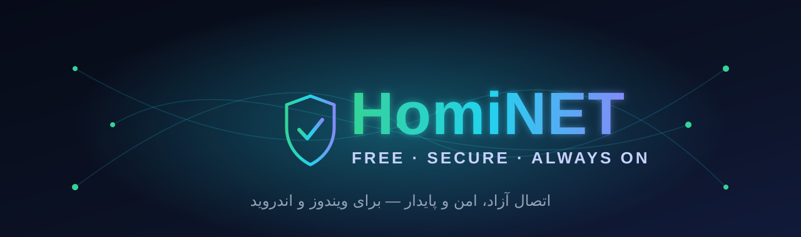

 

### اتصال آزاد، امن و پایدار — در یک برنامه‌ی زیبا و یکپارچه
**Free. Secure. Always on.**

**HomiNET** یک کلاینتِ اتصالِ اختصاصی و همه‌کاره برای **ویندوز** و **اندروید** است؛ ساخته‌شده برای اینکه ساده باشد، سریع وصل شود و **همیشه وصل بماند**. کافی‌ست کانفیگت را وارد کنی و دکمه‌ی اتصال را بزنی — بقیه‌اش با خودِ برنامه است.

---

## ⬇️ دانلود

| ویندوز | اندروید |
|:------:|:------:|
| **[HomiNET برای ویندوز](https://github.com/amir2139/HomiNET/releases/latest)** | **[HomiNET برای اندروید](https://github.com/amir2139/HomiNET/releases/latest)** |
| `.exe` نصب‌کننده · x64 | `.apk` · arm64 |
| ویندوز ۱۰ و ۱۱ | اندروید ۷ به بالا |

**[» همه‌ی نسخه‌ها و آخرین بروزرسانی «](https://github.com/amir2139/HomiNET/releases/latest)**

> روی اندروید بعد از دانلود، اگر پیام «نصب از منبع ناشناس» آمد، اجازه بده. برنامه از بارِ اول آماده است و به دانلودِ چیزی از اینترنت نیاز ندارد.

---

## ✨ امکانات

- 🔌 **اتصالِ یک‌دکمه‌ای** — کانفیگ را وارد کن، وصل شو. بدونِ تنظیماتِ پیچیده.
- ☀️ **خورشید** — برای روزهای قطعی: از لبه‌های CDN عبور می‌کند، نه آی‌پیِ سرور؛ وقتی هیچ‌چیز وصل نمی‌شود، وصل می‌شود.
- 🛰️ **خلبانِ خودکار** — بهترین سرور را خودش پیدا می‌کند، و اگر سروری افتاد، بی‌وقفه جابه‌جا می‌شود تا **همیشه وصل** بمانی.
- 👤 **اکانت شخصی** — ورود با نام کاربری و رمز؛ اعتبار بر اساس تاریخ، ساعتِ اتصال یا حجم.
- 🧩 **پشتیبانی از انواع کانفیگ** — VLESS / Reality، VMess، Trojan، Shadowsocks، Hysteria2، WireGuard و کانفیگ‌های کامل؛ هر نوع در تبِ جدا.
- ☁️ **سرورِ شخصیِ رایگان** — با حسابِ کلادفلرِ خودت، در یک مرحله.
- 🌐 **DNSهای ضدتحریم و رمزدار** — با تستِ زنده از اینترنتِ خودت.
- 📡 **اشتراک و کانالِ تلگرام** — سرورها را از اشتراک یا کانال به‌روز نگه‌دار.
- ⚡ **تستِ سرعت و پینگِ واقعی** — سالم‌ترین و سریع‌ترین سرور، خودکار انتخاب می‌شود.
- 🧪 **آزمایشگاهِ اتصال** — روش‌های مختلف را روی سایت‌های واقعی می‌سنجد.
- 🎭 **SNI spoofing** — صدها اسمِ بی‌خطر (کپچا، سایت‌های ایرانی و…) با اسکنِ زنده روی شبکه‌ی خودت.
- 🪄 **Fragment و نویز با تنظیمِ خودکار** — برای عبور از شبکه‌های سخت‌گیر.
- 🧱 **تونلِ سیستمی (TUN) و تونلِ هر برنامه جدا** — مسیرِ ترافیک را خودت انتخاب کن.
- 🔄 **بروزرسانیِ داخلِ برنامه** — با یک دکمه، آخرین نسخه را می‌گیرد و نصب می‌کند.
- 🔒 **سبک روی مصرف و باتری** — تست‌های سلامت هوشمند، بدونِ هدررفتِ اینترنت.

---

## 🎯 چرا HomiNET؟

| | |
|:--|:--|
| 🎨 **زیبا و روان** | رابطِ کاربریِ تیره، تمیز و فارسی — لذتِ استفاده. |
| 🧠 **هوشمند** | خودش سالم‌ترین مسیر را پیدا و حفظ می‌کند. |
| 📦 **آماده از لحظه‌ی اول** | بدونِ نصبِ جداگانه‌ی موتور یا دانلودِ اضافه. |
| 🔐 **امن** | بروزرسانی‌های امضاشده؛ نسخه‌ی دستکاری‌شده نصب نمی‌شود. |

---

## 🔄 بروزرسانی

HomiNET بروزرسانیِ داخلِ برنامه دارد: از بخشِ تنظیمات، **«بررسی نسخه»** را بزن؛ اگر نسخه‌ی تازه‌ای باشد، خودش دانلود و نصب می‌کند. بروزرسانی‌ها با **اثرِ انگشتِ SHA‑256** بررسی می‌شوند تا فقط نسخه‌ی اصل نصب شود.

---

## 💬 پشتیبانی

سوال، مشکل یا تمدید؟ در تلگرام پیام بده:

### [» @AwmirHomayoun «](https://t.me/AwmirHomayoun)

---

ساخته‌شده با ❤️ توسطِ **amir2139**

© 2026 HomiNET — همه‌ی حقوق محفوظ است. این نرم‌افزار اختصاصی است؛ بازتوزیع، تغییر یا بازمهندسی مجاز نیست.

